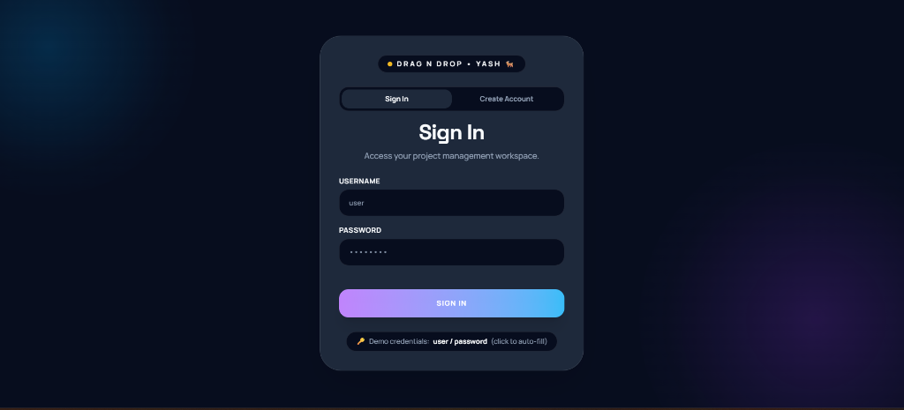
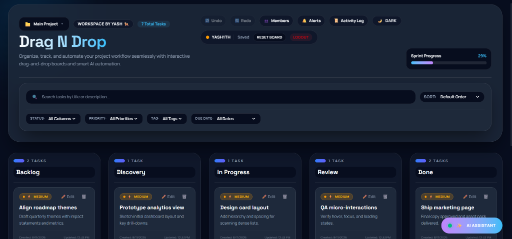

# 🗂️ Drag N Drop Kanban Board • YASH 🐐

A modern, enterprise-grade Kanban project management application featuring dynamic drag-and-drop task workflow management, multi-project workspace isolation, RBAC role security, real-time WebSockets synchronization, and an embedded natural-language AI Assistant.

---

## 🚀 Live Demo & Cloud Backend

- **Frontend Application (Vercel)**: [https://drag-n-drop-lilac.vercel.app/](https://drag-n-drop-lilac.vercel.app/)
- **Live Backend API (Render)**: [https://drag-n-drop-28p3.onrender.com](https://drag-n-drop-28p3.onrender.com)
- **Security & Release Certification**: [`pm/docs/FINAL_RELEASE_CERTIFICATION.md`](./pm/docs/FINAL_RELEASE_CERTIFICATION.md) (**Status: `PRODUCTION READY`**)
- **Master Documentation**: [`documentation/Kanban_Studio_Pro_Master_Documentation.pdf`](./documentation/Kanban_Studio_Pro_Master_Documentation.pdf)

---

## 📸 Screenshots

### 🔑 Login Page


### 📊 Dashboard


---

## ✨ Features

- 🖱️ **Drag and Drop Engine**: Smooth card reordering across workflow columns powered by `@dnd-kit`.
- 📱 **Mobile Touch Optimization**: Vertical stacked column layout on mobile screens with touch-sensor activation delay (`150ms`).
- 🔐 **Authentication & Cryptographic Sessions**: Cryptographically random session token generation (`secrets.token_hex(32)`), session revocation on logout, PBKDF2-HMAC-SHA256 password hashing, user registration, and identity validation.
- 📁 **Multi-Project Workspace**: Create, switch, rename, and isolate independent Kanban project boards.
- 🤖 **AI Kanban Assistant & Model Failover**: Conversational AI parsing natural language prompts with model failover stack (`openai/gpt-4o-mini` -> `meta-llama/llama-3.3-70b-instruct` -> `openrouter/auto` -> Smart Local NLP).
- ⚡ **Real-Time WebSockets**: Live multi-user synchronization across active project sessions (`/ws/projects/{id}`).
- 🛡️ **Role-Based Access Control (RBAC)**: Backend role permission enforcement (`owner`, `admin`, `member`, `viewer`, `none`) protecting projects and cards against unauthorized mutations.
- 📜 **Activity Audit Trail & Notifications**: Automatic logging of all board modifications and team alerts.
- 🔄 **Multi-Level Undo / Redo**: Built-in state history management with keyboard shortcuts (`Ctrl+Z` / `Ctrl+Y`).
- 🎨 **Rich Glassmorphism UI**: Vibrant dark/light mode toggle with custom design system tokens and micro-animations.

---

## 🛠️ Tech Stack

### Frontend
- **Framework**: Next.js 16 (App Router with Turbopack), React 19, TypeScript
- **Styling**: TailwindCSS v4, Custom CSS variables, Glassmorphism design tokens
- **Drag & Drop**: `@dnd-kit/core`, `@dnd-kit/sortable`
- **Testing**: Vitest (44 tests), Playwright E2E (14 tests)

### Backend
- **Framework**: FastAPI (Python 3.13), Uvicorn ASGI Server
- **Database**: SQLite3 (WAL Mode), Python `sqlite3` driver
- **Security**: Cryptographic Session Tokens, PBKDF2-HMAC-SHA256 password hashing (`100,000` iterations)
- **AI Integration**: OpenRouter API (GPT-4o-mini) with Failover Stack & Smart Local NLP
- **Testing**: Pytest (38 tests, including Part 28 Adversarial Security suite)

### DevOps & Cloud Infrastructure
- **Containerization**: Docker (`python:3.13-slim`)
- **Hosting**: Render.com (Cloud Backend API) + Vercel (Edge CDN Frontend)
- **Version Control**: Git & GitHub (`origin main`)

---

## 🏗️ Project Structure

```text
Drag_N_Drop/
├── Dockerfile                        # Root Docker container configuration
├── render.yaml                        # Render Blueprint deployment definition
├── README.md                          # Repository overview & screenshot documentation
├── screenshots/                       # High-resolution application screenshots
│   ├── login.png                      # Login Page UI screenshot
│   └── dashboard.png                  # Dashboard UI screenshot
├── documentation/                     # Master Documentation PDF & Markdown
│   ├── Kanban_Studio_Pro_Master_Documentation.pdf
│   └── Kanban_Studio_Pro_Master_Documentation.md
└── pm/
    ├── backend/                       # Python FastAPI Backend Service
    │   ├── main.py                    # REST & WebSocket API endpoints
    │   ├── database.py                # SQLite schema, hashing, CRUD & RBAC permissions
    │   ├── ai.py                      # AI Assistant rule parser & Gemini integration
    │   ├── websocket_manager.py       # WebSockets broadcasting manager
    │   ├── pm.db                      # SQLite binary database file
    │   └── requirements.txt           # Python dependencies
    └── frontend/                      # Next.js Frontend Application
        ├── src/
        │   ├── app/                   # Next.js App Router pages & globals.css
        │   ├── components/            # React UI components (KanbanBoard, AIAssistantWidget, etc.)
        │   └── lib/                   # API client, filter utilities, and undo/redo hook
        └── tests/
            └── kanban.spec.ts         # Playwright E2E browser tests
```
