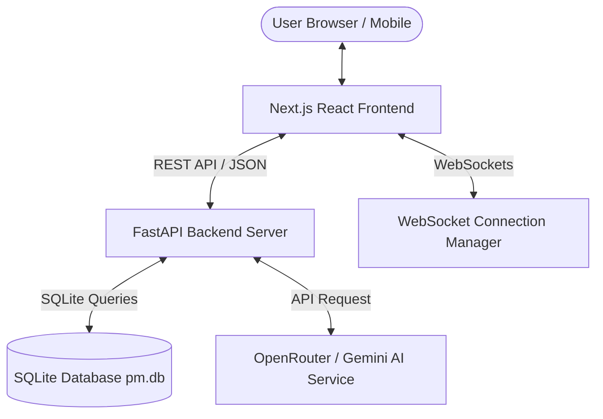

# 🚀 Kanban Studio — AI-Powered Project Management System

**Kanban Studio** is an AI-enhanced, real-time multi-project Kanban application engineered with **FastAPI**, **SQLite**, **React (Next.js)**, and **Tailwind CSS**. It provides flexible task drag-and-drop workflows, workspace multi-tenancy, granular Role-Based Access Control (RBAC), WebSockets real-time sync, due-date notifications, and AI-driven project intelligence.

> 🏆 **Release Certification Status**: **`PRODUCTION READY`** (Parts 1–29 Complete • See [`docs/FINAL_RELEASE_CERTIFICATION.md`](./docs/FINAL_RELEASE_CERTIFICATION.md) and [`docs/PLAN.md`](./docs/PLAN.md))

---

## 🌟 Key Features

### 📋 1. Core Kanban & Workflow Management
- **Interactive Drag-and-Drop**: Built using `@dnd-kit/core` and `@dnd-kit/sortable` with smooth animations and keyboard accessibility.
- **5 Default Workflow Columns**: `Backlog`, `Discovery`, `In Progress`, `Review`, `Done`.
- **Card Metadata & Rich Modal Editor**: Edit titles, details, descriptions, priority levels (`High`, `Medium`, `Low`), due dates, assignees (`@username`), and tags (`#tag`).
- **Real-Time Task Search & Filter Toolbar**: Search cards by title/details, filter by priority or assignee, sort by date/priority, and reset active filters instantly.
- **Optimistic Undo & Redo**: Full `Ctrl+Z` / `Ctrl+Y` keyboard shortcut history stack supporting up to 20 state snapshots.

### 🔐 2. Multi-Project Workspaces & Team RBAC
- **Multi-Project Workspace Switcher**: Seamlessly create, inspect, and switch between independent project boards.
- **Cryptographic Session Token Security**: Session management with `secrets.token_hex(32)`, token verification, and server revocation on `/api/auth/logout`.
- **Granular RBAC Permission Hierarchy**:
  - `👑 Owner` (Level 4): Full administrative control, member invitation, role assignment, board deletion.
  - `🛡️ Admin` (Level 3): Project editing, card creation/movement, member management.
  - `👤 Member` (Level 2): Card creation, drag-and-drop editing, activity participation.
  - `👁️ Viewer` (Level 1): Read-only view access.
  - `🚫 None` (Level 0): Unassigned non-member access blocked (HTTP 403).
- **Audit Activity Log Modal**: Comprehensive event log recording all card movements, edits, member invitations, and project changes.

### ⚡ 3. Real-Time Collaboration & Due-Date Alerts
- **WebSockets Live Sync**: Instant WebSocket state synchronization (`/ws/projects/{project_id}`) across concurrent client sessions with token authentication.
- **Header Live Status Indicator**: Live **🟢 Live Sync** status badge.
- **Notification Center & Due-Date Scanner**: Automatic background scanner generating alerts for tasks due within 48 hours.

### ✨ 4. AI Project Intelligence & Assistant
- **AI Task Automation**: Create, move, clear, or modify cards using natural language commands.
- **OpenRouter & Model Failover Engine**: Connected to OpenRouter API (`openai/gpt-4o-mini`) with multi-model failover stack (`openai/gpt-4o-mini` -> `meta-llama/llama-3.3-70b-instruct` -> `openrouter/auto`).
- **AI Analytical Intelligence**:
  - **📊 Project Summary**: Instant progress metrics, completion rates, and column counts.
  - **👥 Workload Analysis**: Task assignment distribution and bottleneck detection.
  - **⏰ Overdue Tasks**: Scans upcoming/overdue task deadlines.
  - **⚡ Re-Prioritize**: Suggests Backlog prioritization and column balance strategies.
- **Local Fallback Resilience**: Seamless fallback to smart local NLP when external AI network API keys are unconfigured or experiencing transient timeouts.

---

## 📐 System Architecture



---

## 🛠️ Technology Stack

| Layer | Technology |
|---|---|
| **Frontend Framework** | React 19 / Next.js 16 (App Router) |
| **Styling & Icons** | Tailwind CSS v4, Glassmorphism CSS Tokens |
| **Drag & Drop** | `@dnd-kit/core`, `@dnd-kit/sortable` |
| **Backend Framework** | Python 3.13 / FastAPI |
| **Database** | SQLite3 with WAL Mode & Compound Indexes |
| **Real-Time Engine** | FastAPI WebSockets (`WebSocketDisconnect`) |
| **AI Integration** | OpenRouter Chat Completions / Gemini 4o-mini |
| **Testing** | Pytest (Backend), Vitest (Frontend), Playwright (E2E) |
| **Containerization** | Docker, Docker Compose |

---

## 🚀 Quick Start & Installation

### Prerequisites
- Node.js `v20+`
- Python `v3.13+`

### 1. Clone & Setup Environment

```bash
git clone https://github.com/Thanniru-yaswanth03/Drag-N-Drop.git
cd Drag-N-Drop/pm

# Copy environment template
cp .env.example .env
```

### 2. Run Backend Server (FastAPI)

```bash
cd backend
python -m venv venv
# Windows: venv\Scripts\activate | Linux/macOS: source venv/bin/activate
pip install fastapi uvicorn httpx pydantic python-dotenv pytest
python -m uvicorn main:app --host 127.0.0.1 --port 8000
```

### 3. Run Frontend Server (Next.js)

```bash
cd ../frontend
npm install
npm run dev
```

Open **[http://localhost:3000](http://localhost:3000)** or **[http://127.0.0.1:8000](http://127.0.0.1:8000)** in your browser.

---

## 🐳 Docker Deployment

To run the full production application inside a container:

```bash
# Build and run container
docker-compose up --build -d

# Check running status
docker-compose ps
```

The application will be accessible at **[http://localhost:8000](http://localhost:8000)**.

---

## 🧪 Testing Suite
- **Comprehensive Coverage**: 143 total automated tests (85 Pytest backend tests, 44 Vitest frontend unit tests, 14 Playwright end-to-end browser tests).

### 1. Backend Pytest Tests (85 Tests)
```bash
cd backend
python -m pytest
```

### 2. Frontend Vitest Unit Tests (44 Tests)
```bash
cd frontend
npm run test:unit
```

### 3. Playwright E2E Tests (14 Tests)
```bash
cd frontend
npx playwright test
```

---

## 🔐 Production Hardening & Security
- **Authentication Protection**: IP-based rate limiting on `/api/auth/login` and `/api/auth/register` (max 15 attempts/minute).
- **Persistent Database Engine**: Single dynamic path resolver (`DATABASE_PATH=/data/pm.db` on Render with persistent disk), WAL mode, transactional `PUT /api/board` state synchronization, and atomic query-back registration verification.
- **Zero-Seed Guarantee**: Clean initial database without hardcoded accounts, demo cards, or deleted data resurrection.

- **Runtime Diagnostics**: Safe `/api/health` and `/api/diagnostics/db` endpoints for inspecting production database metrics without secret exposure.
- **Git & Container Secrets Exclusion**: `.env` and SQLite database files (`*.db`) are strictly excluded via `.gitignore` and `.dockerignore`.


---

## 📝 License
This project is open-source under the MIT License.
