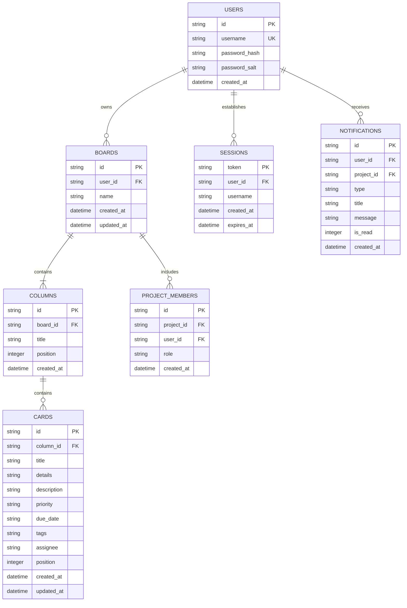

# Database Model & Schema Architecture

## Overview

The Kanban Studio application utilizes an authoritative SQLite relational database (`pm.db`) managed via a centralized dynamic path resolver (`pm/backend/config.py` :: `get_database_path()`).

- **Production (Render)**: Persistent disk volume mounted at `/data`, resolving to `/data/pm.db`.
- **Development**: Local workspace at `pm/backend/pm.db`.
- **Automated Tests**: Isolated temporary file paths injected per test lifecycle.

The system enforces multi-user database-backed authentication with PBKDF2-HMAC-SHA256 password hashing (`100,000` iterations with per-user cryptographic salts), transactional registration with immediate query-back persistence verification, constant-time login verification, and isolated multi-project workspaces per user account.

## Entity-Relationship Diagram



## Relational DDL (SQLite)

```sql
CREATE TABLE IF NOT EXISTS users (
    id TEXT PRIMARY KEY,
    username TEXT UNIQUE NOT NULL,
    password_hash TEXT NOT NULL,
    password_salt TEXT NOT NULL,
    created_at TIMESTAMP DEFAULT CURRENT_TIMESTAMP
);

CREATE TABLE IF NOT EXISTS boards (
    id TEXT PRIMARY KEY,
    user_id TEXT NOT NULL,
    name TEXT NOT NULL,
    created_at TIMESTAMP DEFAULT CURRENT_TIMESTAMP,
    updated_at TIMESTAMP DEFAULT CURRENT_TIMESTAMP,
    FOREIGN KEY (user_id) REFERENCES users(id) ON DELETE CASCADE
);

CREATE TABLE IF NOT EXISTS columns (
    id TEXT PRIMARY KEY,
    board_id TEXT NOT NULL,
    title TEXT NOT NULL,
    position INTEGER NOT NULL,
    created_at TIMESTAMP DEFAULT CURRENT_TIMESTAMP,
    FOREIGN KEY (board_id) REFERENCES boards(id) ON DELETE CASCADE
);

CREATE TABLE IF NOT EXISTS cards (
    id TEXT PRIMARY KEY,
    column_id TEXT NOT NULL,
    title TEXT NOT NULL,
    details TEXT DEFAULT '',
    description TEXT DEFAULT '',
    priority TEXT DEFAULT 'medium',
    due_date TEXT DEFAULT NULL,
    tags TEXT DEFAULT '[]',
    assignee TEXT DEFAULT NULL,
    position INTEGER NOT NULL,
    created_at TIMESTAMP DEFAULT CURRENT_TIMESTAMP,
    updated_at TIMESTAMP DEFAULT CURRENT_TIMESTAMP,
    FOREIGN KEY (column_id) REFERENCES columns(id) ON DELETE CASCADE
);

CREATE TABLE IF NOT EXISTS sessions (
    token TEXT PRIMARY KEY,
    user_id TEXT NOT NULL,
    username TEXT NOT NULL,
    created_at TIMESTAMP DEFAULT CURRENT_TIMESTAMP,
    expires_at TIMESTAMP,
    FOREIGN KEY (user_id) REFERENCES users(id) ON DELETE CASCADE
);

CREATE TABLE IF NOT EXISTS project_members (
    id TEXT PRIMARY KEY,
    project_id TEXT NOT NULL,
    user_id TEXT NOT NULL,
    role TEXT NOT NULL DEFAULT 'member',
    created_at TIMESTAMP DEFAULT CURRENT_TIMESTAMP,
    FOREIGN KEY (project_id) REFERENCES boards(id) ON DELETE CASCADE,
    UNIQUE(project_id, user_id)
);

CREATE TABLE IF NOT EXISTS activity_log (
    id TEXT PRIMARY KEY,
    project_id TEXT NOT NULL,
    user_id TEXT NOT NULL,
    action_type TEXT NOT NULL,
    entity_type TEXT NOT NULL,
    entity_id TEXT NOT NULL,
    message TEXT NOT NULL,
    details TEXT DEFAULT '{}',
    created_at TIMESTAMP DEFAULT CURRENT_TIMESTAMP,
    FOREIGN KEY (project_id) REFERENCES boards(id) ON DELETE CASCADE
);

CREATE TABLE IF NOT EXISTS notifications (
    id TEXT PRIMARY KEY,
    user_id TEXT NOT NULL,
    project_id TEXT DEFAULT NULL,
    type TEXT NOT NULL DEFAULT 'system',
    title TEXT NOT NULL,
    message TEXT NOT NULL,
    is_read INTEGER DEFAULT 0,
    created_at TIMESTAMP DEFAULT CURRENT_TIMESTAMP
);

CREATE INDEX IF NOT EXISTS idx_boards_user_id ON boards(user_id);
CREATE INDEX IF NOT EXISTS idx_columns_board_id ON columns(board_id);
CREATE INDEX IF NOT EXISTS idx_cards_column_id ON cards(column_id);
CREATE INDEX IF NOT EXISTS idx_sessions_token ON sessions(token);
CREATE INDEX IF NOT EXISTS idx_sessions_user_id ON sessions(user_id);
CREATE INDEX IF NOT EXISTS idx_project_members_project_id ON project_members(project_id);
CREATE INDEX IF NOT EXISTS idx_activity_log_project_id ON activity_log(project_id);
CREATE INDEX IF NOT EXISTS idx_notifications_user_id ON notifications(user_id);
```

## Runtime Observability & Health

The server exposes safe diagnostic endpoints (`GET /api/health`, `GET /api/health/db`, `GET /api/diagnostics/db`) to verify:
- Configured and dynamically resolved file paths (`resolvedPath`)
- File existence, parent write permissions, and byte size
- SQLite journal mode (`wal`) and Foreign Key status (`ON`)
- Active row counts (`userCount`, `boardCount`, `cardCount`, `sessionCount`)
*Zero passwords, hashes, salts, or session tokens are ever leaked in responses.*

## Multi-User & Multi-Board Strategy

1. **User Isolation**: Every board record links to a `user_id`. Queries filtering `WHERE user_id = ?` ensure complete data isolation.
2. **Ordered Relations**: Column order is preserved via `position` in the `columns` table. Card order within a column is preserved via `position` in the `cards` table.
3. **Cascading Deletes**: Foreign key constraints with `ON DELETE CASCADE` ensure deleting a board or column automatically cleans up child records without orphans.
4. **Idempotent Startup**: Server startup executes `init_db()` which strictly creates tables and indexes without altering or re-seeding existing data.

