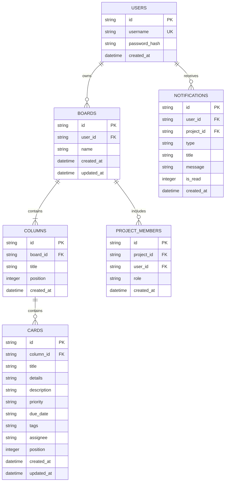

# Database Model & Schema Architecture

## Overview

The Project Management MVP uses a local SQLite relational database (`pm.db`). The database is auto-created on application launch if it does not exist.

The system supports multi-user database-backed authentication with PBKDF2 password hashing (SHA-256), registration (`POST /api/auth/register`), login (`POST /api/auth/login`), and isolated multi-project workspaces per user account.

## Entity-Relationship Diagram



## Relational DDL (SQLite)

```sql
CREATE TABLE IF NOT EXISTS users (
    id TEXT PRIMARY KEY,
    username TEXT UNIQUE NOT NULL,
    password_hash TEXT NOT NULL,
    created_at TIMESTAMP DEFAULT CURRENT_TIMESTAMP
);

CREATE TABLE IF NOT EXISTS boards (
    id TEXT PRIMARY KEY,
    user_id TEXT NOT NULL,
    name TEXT NOT NULL,
    created_at TIMESTAMP DEFAULT CURRENT_TIMESTAMP,
    updated_at TIMESTAMP DEFAULT CURRENT_TIMESTAMP,
    FOREIGN KEY (user_id) REFERENCES users(id) ON DELETE CASCADE
);

CREATE TABLE IF NOT EXISTS columns (
    id TEXT PRIMARY KEY,
    board_id TEXT NOT NULL,
    title TEXT NOT NULL,
    position INTEGER NOT NULL,
    created_at TIMESTAMP DEFAULT CURRENT_TIMESTAMP,
    FOREIGN KEY (board_id) REFERENCES boards(id) ON DELETE CASCADE
);

CREATE TABLE IF NOT EXISTS cards (
    id TEXT PRIMARY KEY,
    column_id TEXT NOT NULL,
    title TEXT NOT NULL,
    details TEXT DEFAULT '',
    description TEXT DEFAULT '',
    priority TEXT DEFAULT 'medium',
    due_date TEXT DEFAULT NULL,
    tags TEXT DEFAULT '[]',
    assignee TEXT DEFAULT NULL,
    position INTEGER NOT NULL,
    created_at TIMESTAMP DEFAULT CURRENT_TIMESTAMP,
    updated_at TIMESTAMP DEFAULT CURRENT_TIMESTAMP,
    FOREIGN KEY (column_id) REFERENCES columns(id) ON DELETE CASCADE
);

CREATE INDEX IF NOT EXISTS idx_boards_user_id ON boards(user_id);
CREATE INDEX IF NOT EXISTS idx_columns_board_id ON columns(board_id);
CREATE INDEX IF NOT EXISTS idx_cards_column_id ON cards(column_id);

CREATE TABLE IF NOT EXISTS activity_log (
    id TEXT PRIMARY KEY,
    project_id TEXT NOT NULL,
    user_id TEXT NOT NULL,
    action_type TEXT NOT NULL,
    entity_type TEXT NOT NULL,
    entity_id TEXT NOT NULL,
    message TEXT NOT NULL,
    details TEXT DEFAULT '{}',
    created_at TIMESTAMP DEFAULT CURRENT_TIMESTAMP,
    FOREIGN KEY (project_id) REFERENCES boards(id) ON DELETE CASCADE
);

CREATE INDEX IF NOT EXISTS idx_activity_log_project_id ON activity_log(project_id);
```

## JSON Board State Mapping

The API and frontend exchange board state as a cohesive JSON structure defined in `docs/schema.json`:

```json
{
  "boardId": "board-default",
  "userId": "user-default",
  "columns": [
    {
      "id": "col-backlog",
      "title": "Backlog",
      "cardIds": ["card-1", "card-2"]
    }
  ],
  "cards": {
    "card-1": {
      "id": "card-1",
      "title": "Align roadmap themes",
      "details": "Draft quarterly themes."
    }
  }
}
```

## Multi-User & Multi-Board Strategy

1. **User Isolation**: Every board record links to a `user_id`. Queries filtering `WHERE user_id = ?` ensure complete data isolation.
2. **Ordered Relations**: Column order is preserved via `position` in the `columns` table. Card order within a column is preserved via `position` in the `cards` table.
3. **Cascading Deletes**: Foreign key constraints with `ON DELETE CASCADE` ensure deleting a board or column automatically cleans up child records.
